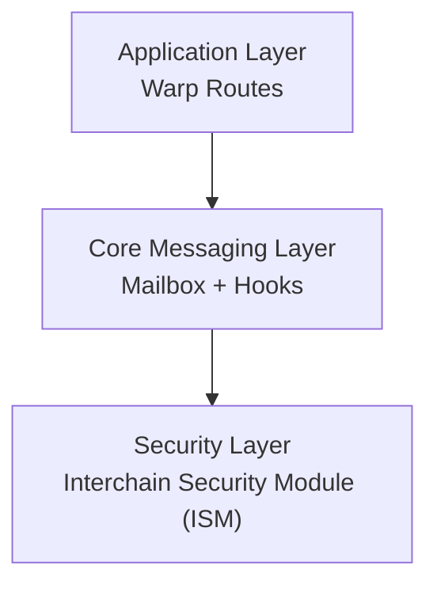

# Getting Started

## Hyperlane architecture overview
Hyperlane is a modular cross-chain messaging protocol. It is structured around on-chain components that produce and verify messages, plus off-chain agents that transport messages and attest to their correctness.

### Hyperlane on-chain components:

#### Application layer:

`Warp Routes` are Hyperlane’s modular token-bridging application, enabling permissionless transfers of native tokens and ERC20 assets across chains with Hyperlane deployments.

- Routes can be configured as native, collateral-backed ERC20, or synthetic ERC20 flows (e.g., lock native or ERC20 collateral on the origin chain and mint synthetic tokens on the destination).
- Each route is implemented with `TokenRouter` contracts that encode/dispatch messages via the `Mailbox` and handle inbound transfer messages on the destination chain.

!!! tip
    On Celestia, the counterpart of a `TokenRouter` is a `Token` instance created by the `x/warp` module.

#### Core messaging layer:

- The `Mailbox` is central in the Hyperlane protocl architecture, it is used for dispatching and processing interchain messages on each chain. Its primary function is routing between various components as well as message sequencing and replay protection.
- The `Post-dispatch hooks` are contracts (or modules) invoked on message dispatch to handle tasks like fee payment (IGP hook) and merkle tree insertion (Merkle Tree Hook).

#### Security layer:

The `ISM (Interchain Security Module)` is the verification layer on the destination chain; it decides the security model and ultimately whether a message can be processed.

- Warp routes have configurable security via ISMs. Each route can define its own verification model, but by default it inherits the `Mailbox` default ISM.
- The merkle root multisig ISM is the flagship ISM of the Hyperlane stack. For detailed information see [Multisig ISM](./multisig-ism.md).

### Agents - off-chain services:

- For multisig bridges Validator agents index origin-chain messages, sign checkpoints (roots), and publish signatures to public storage.
- Relayers fetch messages and validator signatures, build ISM metadata, and submit `Mailbox.process()` on the destination chain.

### Message lifecycle:

The following describes a high level end-to-end message flow. This illustrates the lifecycle of a message from source chain to destination chain.

- A message is dispatched to the origin `Mailbox`, which runs post-dispatch hooks (e.g., Merkle Tree Hook + IGP).
- Validators sign the latest checkpoint and publish signatures off-chain.
- A relayer gathers signatures, packages ISM metadata, and delivers the message to the destination `Mailbox`.
- The destination `Mailbox` calls the configured ISM to verify the message before executing it.
