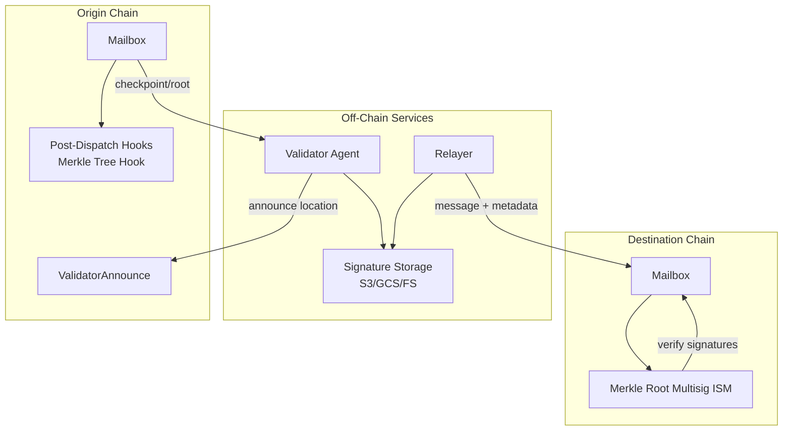

# Merkle Root Multisig ISM + Validator Setup

This page captures the guidance for setting up a Merkle root multisig ISM with validator agents Celestia.

## High-Level Flow
1. Create a new Merkle root multisig ISM on Celestia that defines the validator agents and threshold.
2. Set the routing ISM domain mapping to point to that ISM.
3. Validators announce their signature storage location on the origin chain’s `ValidatorAnnounce` contract.
4. Validators sign roots from the origin mailbox and publish signatures to off-chain storage.
6. Relayers fetch signatures, build ISM metadata, and submit it with messages to Celestia.
7. On-chain logic uses `ecrecover` to validate signatures against the ISM’s validator list. If threshold is met, the message is accepted.

## Merkle Root Multisig ISM Integration

#### Origin chain components:
- `Mailbox` emits new dispatches and calls the Merkle Tree Hook.
- `MerkleTreeHook.latestCheckpoint()` exposes the latest root/checkpoint for validators to sign.
- `ValidatorAnnounce` stores validator storage locations on-chain so relayers can discover signatures.

#### Validator agent components:
- Indexer watches `InsertedIntoTree` events and builds the local merkle tree.
- Checkpoint signer signs the latest checkpoint with an ECDSA key.
- Checkpoint submitter publishes signatures to a public storage location (S3/GCS or local filesystem for dev).

#### Destination chain components:
- Merkle root multisig ISM is deployed with validator addresses and a threshold.
- Relayer submits metadata containing validator signatures with `Mailbox.process()`.
- ISM `verify()` checks that signatures match the configured validator set and threshold.

## Validator Agent Setup (Multisig Bridge)
This is required for any origin chain that uses a Merkle root multisig ISM on the destination side.

### Prerequisites
- Origin-chain RPC access (validators only read from the origin chain).
- An ECDSA key for signing checkpoints (this is the validator identity used by the ISM).
- Public storage for signatures (S3/GCS or a public filesystem path).
- Optional: an origin-chain key funded for the validator announcement transaction.

### Key Concepts
- Validators are configured per origin chain. Run one validator instance per origin chain *per validator key*.
  - To meet an `m-of-n` multisig threshold for a given origin chain, you need `n` distinct validator keys (often operated by different parties), and at least `m` actively publishing signatures.
- The validator announcement happens on the origin chain (the chain whose roots are being signed).
- The validator announcement is the only on-chain transaction a validator needs to make.
- Announcements can be made by anyone, but the validator binary can auto-announce if provided a chain key.
- The relayer is not trusted and can be run by anyone; signatures are public and permissionless to use.
- An origin-chain account is required to publish the (one-time or occasional) `ValidatorAnnounce` transaction. All checkpoint signing uses the validator ECDSA key and happens off-chain.
  - The announce tx key can be the same as the validator signing key, but it does not need to be - as the `ValidatorAnnounce` contract mandates that the storage location is signed by the validator key.

### Minimal Setup Checklist
1. Choose a validator ECDSA signing key and include its address in the destination chain’s Merkle root multisig ISM validator set.
2. Configure a public signature storage location (S3/GCS or a public filesystem path).
3. Configure the validator with:
- Origin chain RPC URL(s).
- Mailbox and Merkle Tree Hook addresses for the origin chain.
- The ECDSA signing key.
- The signature storage location.
4. Announce the validator storage location on the origin chain’s `ValidatorAnnounce` contract.
5. Verify that new signature files are being written for each dispatched message.
6. Confirm the destination chain ISM validator list matches the checkpoint signing keys (static sets are configured at deploy time).

## Notes
- Validators can announce at any time, but relayers cannot fetch signatures until announcements exist.
- The multisig ISM validator list must match the ECDSA checkpoint signing keys used by the validator agents.
