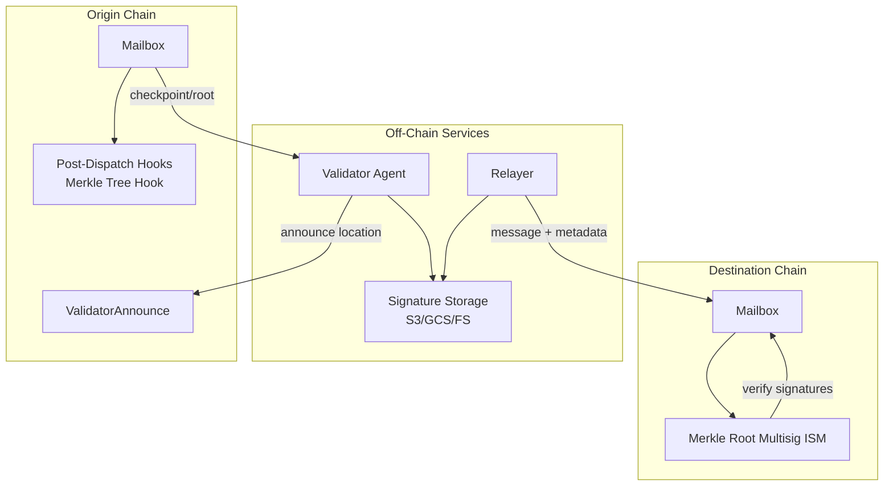

# Merkle Root Multisig ISM + Validator Setup

This page captures the guidance for setting up a Merkle root multisig ISM with validator agents Celestia.

## Merkle Root Multisig ISM Integration

#### Origin chain components:
- `Mailbox` emits new dispatches and calls the Merkle Tree Hook.
- `MerkleTreeHook.latestCheckpoint()` exposes the latest root/checkpoint for validators to sign.
- `ValidatorAnnounce` stores validator storage locations on-chain so relayers can discover signatures.

#### Validator agent components:
- Indexer watches `InsertedIntoTree` events and builds the local merkle tree.
- Checkpoint signer signs the latest checkpoint with an ECDSA key.
- Checkpoint submitter publishes signatures to a public storage location (S3/GCS or local filesystem for dev).

#### Destination chain components:
- Merkle root multisig ISM is deployed with validator addresses and a threshold.
- Relayer submits metadata containing validator signatures with `Mailbox.process()`.
- ISM `verify()` checks that signatures match the configured validator set and threshold.

## Validator Agent Setup (Multisig Bridge)
This is required for any origin chain that uses a Merkle root multisig ISM on the destination side.

### Prerequisites
- Origin-chain RPC access (validators only read from the origin chain).
- An ECDSA key for signing checkpoints (this is the validator identity used by the ISM).
- Public storage for signatures (S3/GCS or a public filesystem path).
- An origin-chain account key funded for the validator announcement transaction.

### Validator Setup Checklist

!!! tip
    Please refer to the official [Hyperlane validator operator guide](https://docs.hyperlane.xyz/docs/operate/validators/run-validators) for more details.

1. Create a validator ECDSA signing key and include its address in the destination chain’s Merkle root multisig ISM validator set.
2. Configure a public signature storage location (S3/GCS or a public filesystem path).
3. Configure the validator agent with the origin chain RPC URL(s), Mailbox and Merkle Tree Hook addresses for the origin chain, the ECDSA signing key, and the signature storage location.
4. Announce the validator storage location on the origin chain’s `ValidatorAnnounce` contract.
5. Verify that new signature files are being written for each dispatched message.
6. Confirm the destination chain ISM validator list matches the checkpoint signing keys (static sets are configured at deploy time).

## Notes
- Validators can announce at any time, but relayers cannot fetch signatures until announcements exist.
- The multisig ISM validator list must match the ECDSA checkpoint signing keys used by the validator agents.
